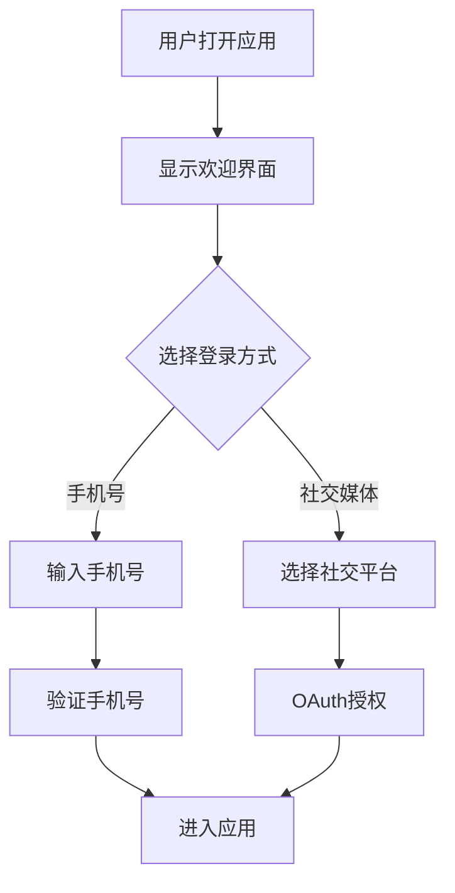

## 1. 产品概述
复刻GODY应用的登录页面，实现移动端iOS风格的欢迎界面和手机号登录功能。
- 提供欢迎界面展示、手机号输入和社交媒体登录选项
- 目标用户为移动应用用户，需要美观的登录体验

## 2. 核心功能

### 2.1 用户角色
| 角色 | 注册方式 | 核心权限 |
|------|----------|----------|
| 普通用户 | 手机号/社交媒体 | 访问应用基本功能 |

### 2.2 功能模块
1. **登录页面**: 欢迎界面、手机号输入、社交媒体登录

### 2.3 页面详情
| 页面名称 | 模块名称 | 功能描述 |
|----------|----------|----------|
| 登录页面 | 欢迎界面 | 展示品牌logo和插画 |
| 登录页面 | 手机号输入 | 国家代码选择和手机号输入 |
| 登录页面 | 社交登录 | Facebook、Twitter、Google登录选项 |

## 3. 核心流程
用户打开应用 → 看到欢迎界面 → 输入手机号或选择社交登录 → 进入应用

## 4. 用户界面设计

### 4.1 设计风格
- 主色调: #fecc2a (金黄色)
- 次要颜色: #ffffff (白色背景), #bdbdbd (灰色边框)
- 按钮样式: 圆角矩形，社交按钮为圆形
- 字体: Roboto字体系统
- 布局风格: 垂直居中布局，卡片式输入框

### 4.2 页面设计概览
| 页面名称 | 模块名称 | UI元素 |
|----------|----------|--------|
| 登录页面 | 欢迎界面 | 黄色标题、城市背景插画、黄色汽车 |
| 登录页面 | 手机号输入 | 国旗图标、国家代码、输入框 |
| 登录页面 | 社交登录 | 三个圆形社交媒体按钮 |

### 4.3 响应式设计
- 桌面优先设计，适配移动端
- 触摸优化，按钮尺寸适合手指点击
- 固定375px宽度模拟iPhone屏幕

### 4.4 3D场景指导
- 无3D场景需求，采用2D平面设计