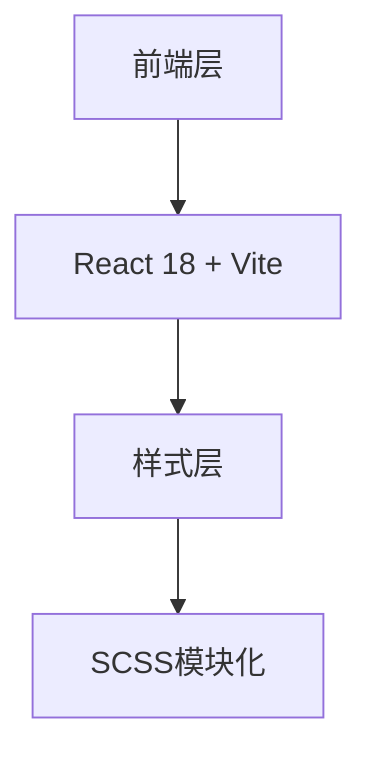

## 1. 架构设计

## 2. 技术描述
- 前端: React@18 + SCSS模块化 + Vite
- 初始化工具: Vite
- 样式: SCSS模块化样式
- 图片资源: SVG和PNG格式的插画资源

## 3. 路由定义
| 路由 | 用途 |
|------|------|
| / | 登录页面主界面 |

## 4. API定义
当前为静态页面，无需API接口

## 5. 服务器架构图
当前为纯前端应用，无需服务器架构

## 6. 数据模型
### 6.1 数据模型定义
无需数据库，纯前端静态页面

### 6.2 数据定义语言
无需DDL语句